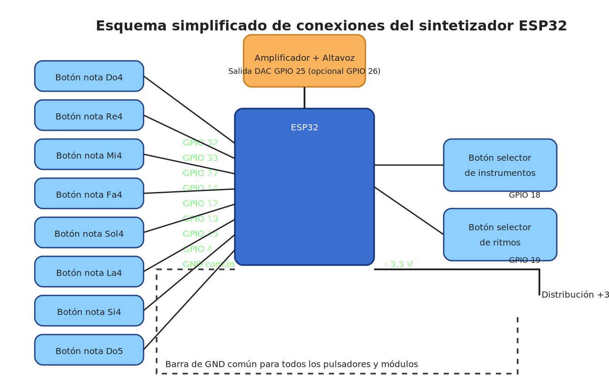

# Guía de cableado del sintetizador ESP32

Este documento describe cómo cablear los botones de notas, los controles adicionales y la salida de audio de la placa ESP32 para el boceto `esp32_synth.ino`.

## Alimentación y referencias
- **VIN / 5V**: Alimenta la placa ESP32 según el módulo utilizado (puede ser por USB o una fuente regulada externa).
- **3V3**: Alimenta los componentes que requieran 3,3 V (por ejemplo, el lado de referencia de los pulsadores si se usan en configuración pull-up externa).
- **GND**: Conecta todas las tierras de botones, altavoz, amplificador y fuente a este punto común.

## Botones de notas (escala de do mayor)
Los ocho pulsadores de nota funcionan en modo **activo a nivel bajo** y en el código se configuran con `INPUT_PULLUP`, por lo que cada botón debe conectar su pin a **GND** cuando se pulsa. Conecta el otro terminal de cada botón al pin GPIO indicado:

| Nota | Pin GPIO ESP32 |
|------|----------------|
| Do4  | GPIO 32        |
| Re4  | GPIO 33        |
| Mi4  | GPIO 27        |
| Fa4  | GPIO 14        |
| Sol4 | GPIO 12        |
| La4  | GPIO 13        |
| Si4  | GPIO 15        |
| Do5  | GPIO 4         |

## Botones de control
Los botones de instrumento y ritmo también se leen como **activo a nivel bajo**. Conecta un terminal del botón a GND y el otro al GPIO correspondiente.

| Función                      | Pin GPIO ESP32 |
|------------------------------|----------------|
| Cambio de instrumento        | GPIO 18        |
| Activación/cambio de ritmos  | GPIO 19        |

## Salida de audio
- El boceto utiliza el **DAC interno del ESP32 en GPIO 25**. Conecta este pin a la entrada de un **amplificador de audio** o a un **altavoz autoamplificado**.
- Añade un condensador de acoplamiento (p. ej. 10 µF en serie) si el amplificador requiere entrada AC y/o para proteger frente a componentes DC.
- Si se conecta directamente a un pequeño altavoz pasivo, utiliza un amplificador intermedio o un módulo clase D para evitar sobrecargar el pin del ESP32.

## Recomendaciones adicionales
- Mantén los cables de señal cortos y, si es posible, utiliza resistencias en serie de 100-220 Ω entre el pin DAC y la entrada del amplificador para reducir el ruido y proteger el microcontrolador.
- Para evitar rebotes mecánicos excesivos, se recomienda emplear pulsadores de buena calidad o añadir condensadores de 0,1 µF en paralelo con cada botón.
- Comprueba que todos los componentes compartan la misma referencia de tierra.
